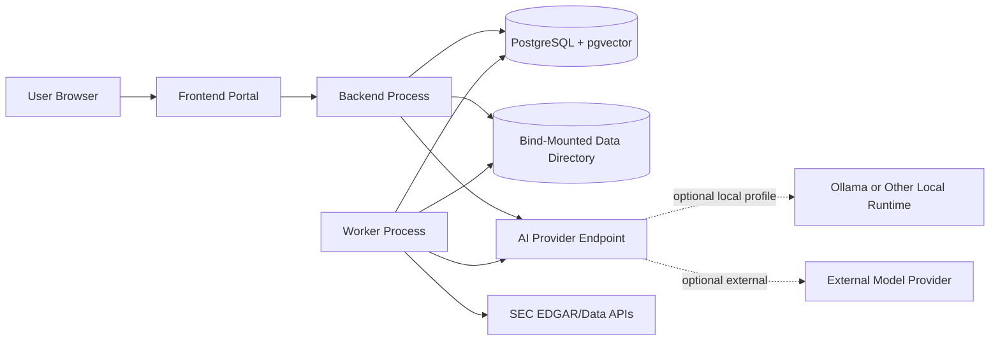
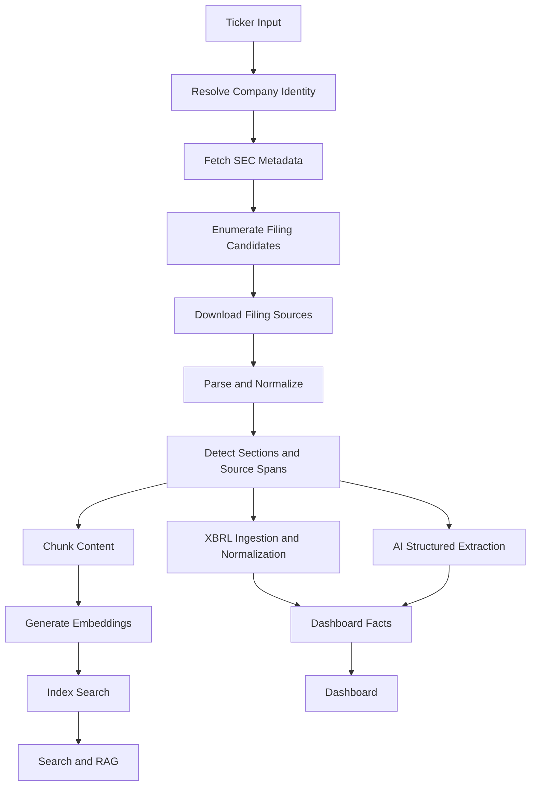
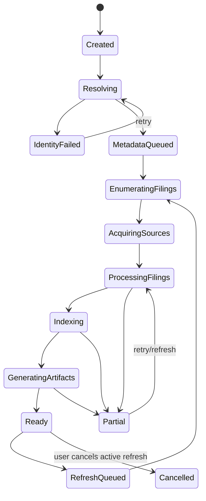
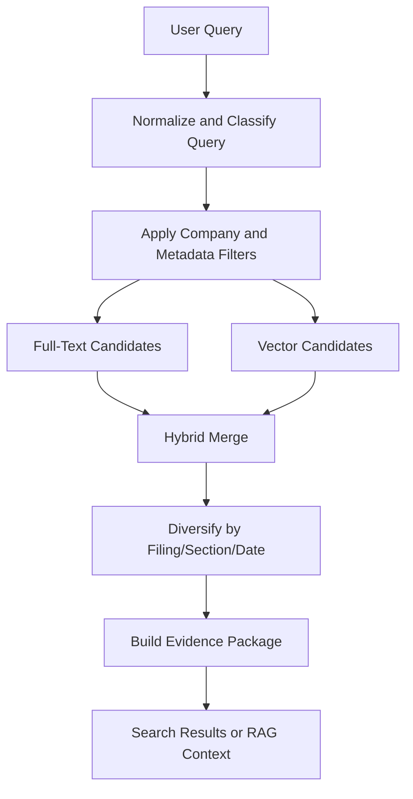

# secThing FRD

Status: Authoritative functional and technical requirements  
Project name: secThing  
Last updated: 2026-09-15

This document defines how secThing must behave technically in order to satisfy `BRD-PRD.md`. It is implementation-ready but intentionally stops short of source code.

## 1. External Constraints and References

Current SEC behavior and access requirements materially affect the architecture.

Authoritative SEC references:

- SEC EDGAR APIs: https://www.sec.gov/search-filings/edgar-application-programming-interfaces
- SEC webmaster FAQ and fair-access guidance: https://www.sec.gov/os/webmaster-faq
- SEC official ticker mapping file: https://www.sec.gov/files/company_tickers.json
- SEC EDGAR archive access guidance: https://www.sec.gov/search-filings/accessing-edgar-data

Design implications:

- SEC JSON APIs must be fetched by the backend/worker, not directly by browser code.
- SEC endpoints do not require an API key for the intended public data APIs.
- Automated access must use a descriptive User-Agent with contact information.
- Scripted requests must respect SEC fair-access limits. Treat 10 requests/second as the maximum global ceiling and use a lower configurable default.
- SEC responses should be cached locally to avoid unnecessary repeated requests.
- Ticker is an input convenience. CIK is the durable SEC identity.
- `app.edgar.tools` may be useful as a convenience lookup, but the official SEC ticker mapping should be the preferred source when possible.

## 2. Technical Objectives

### FRD-OBJ-001: Durable Evidence Pipeline

The system must ingest, preserve, parse, index, and expose SEC evidence with enough provenance to support source-linked search, summaries, dashboards, and chat.

Satisfies: PRD-PRI-001, PRD-GOAL-002, PRD-PROV-001.

### FRD-OBJ-002: Local-First Self-Hosting

The system must run as a self-hosted containerized application with durable storage and configurable local or external AI providers.

Satisfies: PRD-PRI-002, PRD-LOC-001.

### FRD-OBJ-003: Compute-Aware Processing

The system must avoid repeated expensive work by using deterministic extraction, hashes, idempotent stages, provider/version-aware caches, and incremental refresh.

Satisfies: PRD-PRI-003, PRD-GOAL-005.

### FRD-OBJ-004: Recoverable Partial Success

The system must persist progress at company, filing, document, and artifact levels so failures are observable and retryable.

Satisfies: PRD-PRI-004, PRD-ERR-001, PRD-ERR-002.

### FRD-OBJ-005: Evidence-Grounded AI

AI use must be mediated by retrieval, schemas, validation, source references, and model-run audit records.

Satisfies: PRD-RAG-001, PRD-PROV-002, PRD-TRANS-002.

## 3. Architectural Principles

### FRD-ARCH-001: Deep Modules at Stable Seams

Important logic should sit behind small interfaces. Callers should not need to know SEC URL quirks, parse heuristics, provider-specific model payloads, or provenance graph details.

Recommended deep modules:

- `SecClient`
- `CompanyIdentityResolver`
- `FilingAcquisition`
- `FilingParser`
- `EvidenceStore`
- `ChunkingAndEmbedding`
- `Retrieval`
- `AiProvider`
- `ArtifactGenerator`
- `DashboardAssembler`

### FRD-ARCH-002: Separate Runtime Processes, Shared Codebase

Backend and worker should share application modules but run as separate processes/containers.

Rationale:

- keeps frontend requests responsive;
- allows long-running ingestion to be isolated;
- avoids premature microservice separation;
- allows common domain logic and database adapters to remain local.

### FRD-ARCH-003: PostgreSQL First

Use PostgreSQL plus pgvector for MVP metadata, durable jobs, full-text search, and vector search. Do not introduce Redis, a separate vector database, MinIO, or a dedicated search engine until a validated limitation requires it.

### FRD-ARCH-004: Filesystem for Large Source Artifacts

Store large raw SEC documents, API response bodies, and bulky parse artifacts in bind-mounted filesystem storage. Store paths, hashes, metadata, source spans, chunks, facts, and generated artifacts in PostgreSQL.

### FRD-ARCH-005: Provider-Agnostic AI

Application logic must depend on chat and embedding provider interfaces, not directly on Ollama, llama.cpp, vLLM, or a closed-source provider.

### FRD-ARCH-006: No LLM as Primary Parser

LLMs may enrich parsed content after deterministic parsing. They must not be the primary mechanism for discovering filings, extracting raw financial metrics, or locating source evidence.

## 4. System Context



Only the frontend should be exposed to the user by default. Backend, worker, database, and AI runtime should communicate over the Docker network unless explicitly configured otherwise.

## 5. Runtime Modules and Process Responsibilities

### 5.1 Frontend Portal

Responsibilities:

- company library/home;
- add company flow;
- ingestion configuration;
- ingestion progress;
- company dashboard;
- filing browser;
- financial fact views;
- search;
- cited chat;
- source inspection;
- provider/settings views;
- system and worker status.

The frontend must not fetch SEC endpoints directly.

### 5.2 Backend Process

Responsibilities:

- frontend-facing HTTP interface;
- companies, filings, jobs, search, chat, dashboard, settings;
- validation of user actions;
- read/write database access;
- enqueueing durable work;
- retrieval and RAG request orchestration;
- provider configuration validation;
- citation/provenance enforcement at response time.

### 5.3 Worker Process

Responsibilities:

- claim and execute durable work items;
- SEC acquisition;
- ticker/CIK resolution;
- filing enumeration and download;
- parsing and normalization;
- section detection;
- XBRL ingestion and normalization;
- chunking;
- embeddings;
- structured extraction;
- filing summaries;
- event/timeline generation;
- dashboard artifact refresh;
- retries, resume, and cancellation checks.

### 5.4 Database

Responsibilities:

- durable application state;
- company identity and filing metadata;
- job/work item state;
- source spans and provenance;
- sections and chunks;
- full-text indexes;
- vector indexes;
- financial facts;
- generated artifacts;
- prompt/model run audit records;
- settings metadata that is safe to store.

### 5.5 File Storage

Responsibilities:

- raw SEC API responses;
- raw filing index pages;
- original filing documents and exhibits;
- normalized full-document text;
- parser intermediate artifacts when too large for the DB;
- model/cache artifacts when they are file-sized rather than record-sized.

### 5.6 AI Runtime/Provider

Responsibilities:

- expose chat/completion behavior;
- expose embedding behavior;
- report errors and basic capability information where available;
- respect provider configuration;
- never be assumed to have stable output quality without validation.

## 6. Internal Networking

### FRD-NET-001: Docker Network Isolation

The Compose network should expose only required ports to the host. Database and worker ports should not be exposed by default.

### FRD-NET-002: Configurable Provider Endpoint

The backend and worker must reach the AI provider through configured base URLs. This may point to:

- an Ollama profile in the same Compose project;
- a host machine runtime;
- a separately deployed llama.cpp/vLLM server;
- an external provider endpoint.

## 7. Primary Data Flow



## 8. Ingestion Architecture

### Decision

Use a durable staged pipeline with explicit state transitions persisted in PostgreSQL. Do not implement one giant pipeline function. Do not introduce a general DAG engine in MVP.

Rationale:

- explicit stages make partial progress observable;
- each stage can be retried idempotently;
- interruption can resume from persisted state;
- the pipeline remains simpler than adopting Airflow/Temporal/Celery-like infrastructure early;
- future DAG behavior can be added by scheduling dependent work items.

### FRD-ING-001: Staged Work

Ingestion must be decomposed into durable stages:

1. resolve company identity;
2. fetch company metadata;
3. enumerate filings;
4. acquire filing sources;
5. parse documents;
6. detect sections/source spans;
7. ingest XBRL facts;
8. chunk;
9. embed;
10. build search indexes;
11. run structured extraction;
12. generate summaries/events/dashboard artifacts.

### FRD-ING-002: Stage Idempotency

Every ingestion stage must be safe to retry. If inputs and configuration hashes are unchanged, the stage should skip or reuse previous outputs.

### FRD-ING-003: Filing-Level Independence

Filing stages must run independently enough that one failed filing does not fail the entire company ingestion.

### FRD-ING-004: Incremental Refresh

Refresh must compare current SEC filing metadata against persisted accessions and enqueue work only for new, changed, or invalidated filings.

## 9. Company Ingestion State Machine

Company-level state is derived from stage/work item state, but the UI should expose a simplified company status.



Filing-level states:

- `discovered`
- `source_queued`
- `source_acquired`
- `source_failed`
- `parse_queued`
- `parsed`
- `parse_failed`
- `sectioned`
- `chunked`
- `embedded`
- `extracting`
- `processed`
- `partial`
- `skipped`

## 10. Job and State Model

### FRD-JOB-001: PostgreSQL Durable Work Queue in MVP

Use PostgreSQL tables for jobs/work items in MVP.

Required behavior:

- pending work item selection with row locking;
- worker lease/heartbeat;
- retry count and next-at timestamp;
- cancellation requested flag;
- stage-level progress metadata;
- error code and message;
- correlation to company, filing, document, or artifact.

Suggested table concepts:

- `jobs`: user-visible high-level operation.
- `work_items`: stage-level executable units.
- `work_item_events`: optional append-only logs for debugging/progress.

### FRD-JOB-002: Redis/Celery Deferred

Do not add Redis, Celery, RQ, or a distributed workflow engine in MVP unless PostgreSQL-based work claiming fails a concrete requirement.

### FRD-JOB-003: Resume Behavior

On worker startup, expired leases must return to a retryable state. Completed stages must not be repeated unless invalidated.

### FRD-JOB-004: Cancellation

Cancellation should stop scheduling new dependent work and allow active work to finish or checkpoint safely. It must not delete already acquired evidence.

## 11. Ticker to CIK Resolution

### FRD-ID-001: CIK as Durable Identity

Company records must be keyed by CIK for SEC identity. Ticker should be stored as an alias/input, not the primary identity.

### FRD-ID-002: Official Lookup First

The resolver should prefer the official SEC company ticker mapping file when resolving ticker to CIK.

Optional fallback:

- `https://app.edgar.tools/tools/cik-lookup.json?q={ticker}`

Fallback data must be marked by source.

### FRD-ID-003: CIK Formatting

CIKs must be stored in canonical integer form and formatted as 10-digit zero-padded strings for SEC URL construction.

### FRD-ID-004: Ambiguity Handling

If a ticker maps ambiguously or the resolved company conflicts with existing records, ingestion must pause for user-visible correction or explicit selection.

## 12. Company Identity Handling

Store:

- CIK;
- current ticker aliases;
- original user-entered ticker;
- company name;
- former names when available;
- exchange when available;
- SIC when available;
- fiscal year end when available;
- identity source and fetch timestamp.

Mergers, ticker changes, and issuer identity changes are not deeply reconciled in MVP. The data model must not assume ticker immutability.

## 13. SEC Request Client

### FRD-SEC-001: Central SEC Client Module

All SEC HTTP access must go through a single `SecClient` module.

The interface should hide:

- User-Agent construction;
- rate limiting;
- retries/backoff;
- raw response caching;
- URL construction;
- response hash calculation;
- SEC-specific error handling.

### FRD-SEC-002: User-Agent Configuration

SEC requests must include a configured descriptive User-Agent with contact information.

Startup must warn or block SEC ingestion when no acceptable User-Agent is configured.

### FRD-SEC-003: Rate Limit

The client must enforce a global SEC request rate. Default should be below the SEC maximum. The configured value must never exceed the documented SEC ceiling unless a future SEC policy changes.

### FRD-SEC-004: Retry and Backoff

429, 403 caused by fair-access behavior, transient 5xx, and network failures must use bounded retry with exponential backoff and jitter.

### FRD-SEC-005: No Browser SEC Calls

The frontend must not call SEC endpoints directly.

## 14. Raw Response Caching

### FRD-CACHE-001: Cache SEC Responses

SEC API responses and filing documents must be cached by URL and response metadata.

Store:

- URL;
- method;
- request timestamp;
- response status;
- content type;
- headers useful for revalidation;
- body path;
- content hash;
- source system;
- fetch error if applicable.

### FRD-CACHE-002: Immutable Filing Sources

Downloaded filing documents should be treated as immutable evidence once stored. If a later fetch differs, store a new version and flag the difference.

### FRD-CACHE-003: Revalidation Policy

Submissions and companyfacts may be refreshed. Filing documents should not be repeatedly fetched unless missing, corrupt, or explicitly revalidated.

## 15. Filing Enumeration and Filtering

### FRD-FILING-001: Submissions API

Use SEC submissions data to enumerate filing candidates.

The enumerator must handle:

- recent filings included directly in submissions response;
- older filing files referenced by the submissions response;
- missing optional fields;
- multiple tickers/exchanges;
- amendments;
- filing date and report date differences.

### FRD-FILING-002: MVP Form Filter

MVP ingestion should include:

- `10-K`
- `10-Q`
- `8-K`

Amended forms such as `10-K/A`, `10-Q/A`, and `8-K/A` may be stored and displayed. MVP may skip AI extraction for amendments unless configured.

### FRD-FILING-003: Lookback Window

Filtering should use filing date for inclusion by default. Report date should be stored and displayed separately.

### FRD-FILING-004: Stable Filing Identity

Accession number must be the durable filing identity within a CIK.

Uniqueness:

- `(cik, accession_number)` must be unique.

## 16. Filing Download Pipeline

### FRD-DL-001: Archive URL Construction

Filing archive URLs must be derived from CIK and accession number according to SEC archive conventions, using the accession number without dashes where required.

### FRD-DL-002: Filing Index Acquisition

The pipeline should acquire filing index metadata where available before selecting documents.

### FRD-DL-003: Primary Document Download

The pipeline must download the primary document for supported forms.

### FRD-DL-004: Exhibit Preservation

MVP should preserve document metadata for exhibits and may download selected exhibits later. MVP parsing can focus on the primary document.

### FRD-DL-005: Source Integrity

Every downloaded document must have a content hash and local path.

## 17. Filing Document Selection

### FRD-DOC-001: Primary Document Preference

Use SEC-provided primary document fields when available. If unavailable, inspect filing index metadata to select the filing document.

### FRD-DOC-002: Document Type Classification

Classify filing documents by type:

- primary filing;
- exhibit;
- XBRL artifact;
- image/binary;
- unknown.

### FRD-DOC-003: Unsupported Document Handling

Unsupported documents should be preserved as metadata and skipped with visible status, not treated as fatal.

## 18. Parsing Pipeline

### FRD-PARSE-001: Deterministic Parsing First

Parsing must be deterministic and reproducible. The parser may use document structure, HTML parsing, text normalization, heading heuristics, and SEC form knowledge. It must not require an LLM.

### FRD-PARSE-002: Parser Inputs

Parser input:

- document path;
- document content type;
- form type;
- filing metadata;
- parser version.

Parser output:

- normalized text path;
- document text hash;
- detected sections;
- source spans;
- parser warnings;
- parser failure status if any.

### FRD-PARSE-003: HTML/Text Support

MVP parser must support modern HTML filings and plain-text filings enough to extract readable text. Older or malformed filings may partially fail with observable errors.

### FRD-PARSE-004: Reproducible Parser Versions

Parser version must be recorded. Parser upgrades may invalidate downstream sections, chunks, embeddings, and generated artifacts.

## 19. Section Identification

### FRD-SECDET-001: Form-Aware Sections

Section detection must be form-aware.

Initial section targets for 10-K/10-Q:

- Business;
- Risk Factors;
- Legal Proceedings;
- MD&A;
- Financial Statements;
- Controls and Procedures;
- Management;
- Exhibits.

Initial section targets for 8-K:

- numbered Item headings when available;
- signature;
- exhibits.

### FRD-SECDET-002: Confidence

Detected sections must include a confidence/status:

- `detected`
- `partial`
- `ambiguous`
- `not_found`

### FRD-SECDET-003: Raw Fallback

If section detection fails, the normalized document can still be chunked as an unknown section.

## 20. Normalization

### FRD-NORM-001: Normalized Text

Normalized text should:

- remove non-content markup;
- preserve readable paragraphs;
- preserve headings;
- normalize whitespace;
- retain enough offset mapping to support source spans;
- avoid destructive transformations that make snippets misleading.

### FRD-NORM-002: Source Offsets

Offsets should be recorded against normalized text. Raw byte offsets are optional in MVP but should be supported later if parser artifacts allow.

### FRD-NORM-003: Hashing

Normalized text hash must be recorded and used to decide downstream invalidation.

## 21. Table Handling Strategy

### Decision

MVP should not attempt perfect table reconstruction. Financial metrics should come from XBRL normalization where possible.

### FRD-TABLE-001: Preserve Tables

The parser should preserve table text in normalized output when readable and store table presence metadata.

### FRD-TABLE-002: Do Not Infer Metrics from Tables in MVP

Do not ask AI to infer primary financial metrics from arbitrary filing tables in MVP when XBRL facts are available or expected.

### FRD-TABLE-003: Future Table Extraction

The storage model should allow later table artifacts without changing filing identity or source span design.

## 22. Chunking Strategy

### Decision

Use section-aware, content-type-aware chunking. Do not use one universal chunk profile for all content.

### FRD-CHUNK-001: Chunk Inputs

Chunking input:

- normalized text;
- section boundaries;
- content type;
- target embedding model constraints;
- chunking profile version.

### FRD-CHUNK-002: Chunk Profiles

MVP should support at least:

- narrative section profile;
- unknown section fallback profile;
- table-heavy profile;
- short event/8-K profile.

### FRD-CHUNK-003: Chunk Metadata

Each chunk must store:

- company;
- filing;
- document;
- section when available;
- normalized text offsets;
- chunk text;
- chunk hash;
- token estimate;
- chunk profile version.

### FRD-CHUNK-004: Overlap Discipline

Overlap should be modest and profile-specific. Excessive overlap increases embedding cost and duplicate retrieval.

### FRD-CHUNK-005: Rechunking Invalidation

Changing chunking profile or normalized text hash invalidates downstream embeddings and AI artifacts that depend on old chunks.

## 23. XBRL Ingestion

### FRD-XBRL-001: Companyfacts Ingestion

Fetch and persist raw SEC companyfacts data for each company.

### FRD-XBRL-002: Raw and Normalized Storage

Store:

- raw facts as source data;
- normalized dashboard facts as queryable records;
- source accession/form references when provided.

### FRD-XBRL-003: Initial Concepts

Initial normalized concepts:

- revenue;
- net income;
- assets;
- liabilities;
- cash and cash equivalents;
- operating cash flow;
- debt;
- shares outstanding;
- EPS.

### FRD-XBRL-004: Units and Periods

Financial facts must retain:

- taxonomy;
- concept;
- unit;
- value;
- period start/end or instant date;
- fiscal year;
- fiscal period;
- form;
- accession number when available;
- frame when available.

## 24. XBRL Normalization and Conflict Handling

### FRD-FIN-001: Normalization Mapping

Use an explicit concept mapping table/configuration for dashboard metrics rather than ad hoc string matching.

### FRD-FIN-002: Period Semantics

The system must distinguish:

- duration facts;
- instant facts;
- annual facts;
- quarterly facts;
- trailing or framed facts when available.

### FRD-FIN-003: Conflict Policy

When multiple facts conflict for the same concept/period/unit:

1. prefer facts tied to the most recent amendment when forms represent the same period;
2. prefer 10-K for annual display where appropriate;
3. retain all conflicting raw facts;
4. mark normalized metric status as `selected`, `ambiguous`, or `conflicting`;
5. never silently average or merge conflicting values.

### FRD-FIN-004: AI Financial Limits

AI may explain selected metrics but must not invent, reconcile, or calculate primary metrics unless a deterministic calculation rule exists and is recorded.

## 25. Embedding Pipeline

### FRD-EMB-001: Separate Embedding Provider

Embeddings must use a distinct provider configuration from chat/completion models.

Rationale:

- embedding dimensionality affects storage/indexes;
- changing embedding models requires re-embedding;
- strong chat models are not necessarily embedding providers;
- external/local choices may differ.

### FRD-EMB-002: Embedding Records

Each embedding record must include:

- chunk ID;
- embedding provider;
- embedding model;
- embedding dimension;
- embedding profile/version;
- chunk hash;
- vector;
- created timestamp.

### FRD-EMB-003: Re-Embedding

Changing active embedding model, dimension, or embedding profile must mark old embeddings inactive for new retrieval and enqueue re-embedding as needed.

### FRD-EMB-004: Search Availability

If embeddings are unavailable, full-text search should remain available.

## 26. Vector Storage

### FRD-VEC-001: pgvector MVP

Use pgvector in PostgreSQL for vector storage in MVP.

### FRD-VEC-002: Active Embedding Profile

Search must use the active embedding profile for a company unless the user/admin chooses otherwise.

### FRD-VEC-003: Dimension Compatibility

The system must not mix vector dimensions in one incompatible index. Embedding profile metadata must enforce dimension compatibility.

## 27. Full-Text and Semantic Search

### Decision

MVP should implement hybrid retrieval using PostgreSQL full-text search plus pgvector semantic search, combined with metadata filters.

Dedicated search engines are deferred.

### FRD-SEA-001: Full-Text Index

Chunks or sections must be indexed for PostgreSQL full-text search.

### FRD-SEA-002: Semantic Search

Semantic search must retrieve chunks using the active embedding profile.

### FRD-SEA-003: Metadata Filters

Search must support filters for:

- company;
- form type;
- filing date range;
- section type;
- filing status.

### FRD-SEA-004: Hybrid Ranking

Initial hybrid ranking may use reciprocal rank fusion or a similarly simple deterministic combiner.

### FRD-SEA-005: Result Shape

Search result records must include:

- source span/chunk ID;
- company;
- filing accession;
- form type;
- filing date;
- report date when available;
- document;
- section label/type when available;
- snippet;
- score metadata.

### FRD-SEA-006: Reranking Deferred

Cross-encoder or LLM reranking is deferred until retrieval quality measurements justify it. The retrieval interface should allow later rerank insertion.

## 28. Retrieval Architecture



### FRD-RET-001: Evidence Precision

Retrieval must favor evidence precision over maximum context volume.

### FRD-RET-002: Source Diversity

For broad questions, retrieval should avoid returning many near-duplicate chunks from one filing when relevant evidence exists across filings or years.

### FRD-RET-003: Numeric Query Routing

Queries asking for financial metrics should consult normalized financial facts before or alongside narrative chunks.

## 29. RAG Context Builder

### FRD-RAG-001: Evidence Package

The RAG context builder must create an evidence package containing:

- source IDs;
- source snippets or chunk text;
- citation labels;
- filing metadata;
- section metadata;
- selected financial facts when relevant;
- token budget accounting.

### FRD-RAG-002: Context Budget

Context construction must respect configured provider limits and reserve output budget.

### FRD-RAG-003: No Anonymous Context

Every context fragment passed to a chat model must have a stable source ID that can be cited.

## 30. Citation Generation and Validation

### FRD-CITE-001: Citation Model

A citation must refer to a persisted source span, chunk, financial fact, or source-backed artifact.

Minimum fields:

- citation ID;
- company ID/CIK;
- filing accession when applicable;
- form type when applicable;
- filing date when applicable;
- document ID;
- section ID when available;
- source span or fact ID;
- snippet.

### FRD-CITE-002: Answer Schema

RAG answers must be generated into a structured schema that separates:

- answer text;
- cited claims;
- citations;
- unsupported notes;
- limitations.

### FRD-CITE-003: Citation Validation

Before returning an answer, the backend must validate that cited source IDs exist in the evidence package supplied to the model.

### FRD-CITE-004: Unsupported Answer Behavior

If no adequate evidence is retrieved, the answer must state that the indexed filings do not provide sufficient support.

### FRD-CITE-005: No Retroactive Provenance Guessing

The system must not generate a claim first and later attempt to infer citations from search. Provenance must be present in the evidence package used for generation.

## 31. Structured AI Extraction

### FRD-AIEXT-001: Bounded Source Packages

Structured extraction must operate on bounded source packages such as a section, filing, or selected set of chunks. It must not blindly process all company filings at once.

### FRD-AIEXT-002: Strict Output Schemas

Persistent AI-derived artifacts must be produced as strict JSON matching versioned schemas.

### FRD-AIEXT-003: Validation Required

Invalid model output must be rejected, retried within limits, or stored as failed. It must not be silently accepted.

### FRD-AIEXT-004: Source References Required

Persistent extracted facts, events, themes, and summaries must include source references when the schema requires them.

### FRD-AIEXT-005: Artifact Types

MVP persistent AI artifacts may include:

- filing summary;
- section summary;
- risk theme;
- business/product note;
- legal/regulatory note;
- management/governance note;
- capital structure note;
- event candidate.

Chat answers are conversational artifacts and must not become primary evidence.

## 32. Event and Timeline Generation

### FRD-EVT-001: Event Sources

Event generation may use:

- 8-K item sections;
- selected 10-K/10-Q sections;
- XBRL period changes;
- validated AI extraction outputs.

### FRD-EVT-002: Event Fields

Event records must include:

- company;
- event date;
- event type;
- title;
- summary;
- confidence/status;
- source references;
- generating model/prompt when AI-derived.

### FRD-EVT-003: Event Taxonomy

Use the product-level taxonomy from `BRD-PRD.md` as first-level categories. Secondary tags may be freeform but must not replace first-level classification.

### FRD-EVT-004: Deduplication

Event generation should detect likely duplicate events across filings and amendments. MVP may mark possible duplicates rather than fully reconciling them.

## 33. Filing Summaries and Multi-Year Synthesis

### FRD-SYN-001: Hierarchical Summarization

Multi-year synthesis must use hierarchical processing:

1. source spans/chunks;
2. section summaries;
3. filing summaries;
4. period/year summaries;
5. company-level synthesis.

Each layer must preserve references to lower-level source evidence.

### FRD-SYN-002: Retrieval-Driven Longitudinal Questions

Questions such as "How has management's discussion of competition changed over ten years?" should retrieve relevant sections and summaries across time, then synthesize across the retrieved evidence. The system must not dump ten years of filings into one prompt by default.

### FRD-SYN-003: Long Context Use

Long context may be used for bounded synthesis when:

- source package size is known;
- citations remain mapped;
- output is persisted with model/prompt metadata;
- the cost is justified by the artifact.

Long context is not the default retrieval mechanism.

### FRD-SYN-004: Summary Cache

Summaries must be cached by source hash, prompt version, schema version, taxonomy version, and model configuration.

## 34. Dashboard Generation

### Decision

Dashboard content should combine dynamic deterministic queries and persisted generated artifacts. It must not regenerate expensive AI content on every page load.

### FRD-DASH-001: Dynamic Dashboard Data

Render dynamically:

- company identity;
- filing coverage;
- ingestion status;
- recent filings;
- parse failures;
- selected financial fact queries.

### FRD-DASH-002: Persisted Dashboard Artifacts

Persist:

- filing summaries;
- risk theme summaries;
- event timeline entries;
- business evolution synthesis;
- open questions;
- generated company snapshot.

### FRD-DASH-003: Lazy Generation

Nonessential generated artifacts may be lazily generated after core ingestion or on first request, but the UI must show pending status.

### FRD-DASH-004: Invalidation

Dashboard artifacts must be invalidated when their source data, prompt, taxonomy, parser, or model configuration changes materially.

## 35. Evidence Hierarchy

Evidence levels:

| Level | Type | Can support final user claims? | Notes |
| --- | --- | --- | --- |
| 1 | Raw SEC document/API response | Yes | Primary evidence |
| 2 | Deterministic parsed text/source span | Yes | Derived from raw source with parser version |
| 3 | Structured SEC/XBRL fact | Yes | Primary for financial metrics when sourced |
| 4 | AI-extracted structured artifact | Yes, if source-backed | Must retain citations |
| 5 | Generated summary/synthesis | Limited | Should cite underlying sources |
| 6 | Chat answer | No as future evidence | Ephemeral/conversational unless explicitly stored as notes |

### FRD-EVID-001: Primary Evidence Preference

When both raw/deterministic evidence and generated artifacts are available, retrieval and answer generation should prefer raw/deterministic evidence for factual claims.

### FRD-EVID-002: Source-Backed Artifacts

Generated artifacts may be reused for navigation or synthesis only if their provenance is preserved.

## 36. Provenance Graph and Data Model

### FRD-PROV-001: Provenance First-Class

Provenance must be modeled as first-class data, not a freeform string appended to generated text.

Core provenance concepts:

- `source_documents`: original SEC documents or API response bodies.
- `normalized_documents`: parser output tied to source document hash/version.
- `source_spans`: offset ranges in normalized documents.
- `filing_sections`: semantic groupings of source spans.
- `chunks`: retrievable text units tied to spans.
- `financial_facts`: structured sourced facts.
- `artifacts`: generated or deterministic derived outputs.
- `artifact_evidence`: links artifacts to source spans, chunks, facts, or lower-level artifacts.
- `model_runs`: AI call audit records.

### FRD-PROV-002: Claim-Level Evidence

Persistent generated artifacts containing multiple factual claims should store evidence at the smallest practical unit, such as event, theme, bullet, or claim.

### FRD-PROV-003: Provenance Validation

Artifact creation must fail or degrade to `unsupported`/`needs_review` when required evidence references are missing.

## 37. Confidence and Status Semantics

Use explicit status fields rather than pretending all outputs are equal.

Recommended statuses:

- `raw`
- `deterministic`
- `extracted`
- `generated`
- `unsupported`
- `ambiguous`
- `conflicting`
- `failed`
- `needs_review`

Confidence fields may be numeric only when useful, but user-facing displays should prefer clear status language over false precision.

## 38. Prompt Registry and Versioning

### FRD-PROMPT-001: Prompt Registry

Prompts used for persistent artifacts must be registered with:

- prompt name;
- prompt version;
- expected schema version;
- taxonomy version;
- purpose;
- input requirements.

### FRD-PROMPT-002: Prompt Changes

Changing a prompt version must not overwrite existing artifacts without recording the old version. Reprocessing should create updated artifacts or mark stale artifacts.

### FRD-PROMPT-003: Schema Versioning

Structured output schemas must be versioned. Schema changes must have migration or reprocessing rules.

## 39. Model-Run Auditing

### FRD-MODELRUN-001: Audit Records

Every AI call that produces a persistent artifact must create a model-run record with:

- provider;
- model;
- endpoint profile;
- prompt version;
- schema version;
- source input references;
- input hash;
- output hash;
- validation status;
- timing;
- error details when applicable.

### FRD-MODELRUN-002: Chat Auditing

Chat calls may store lighter audit records, but must still preserve enough information to debug citations and provider behavior.

## 40. Provider Abstraction

### Decision

Use separate chat and embedding provider interfaces. Treat OpenAI-compatible behavior as a useful HTTP shape, not a complete semantic guarantee.

### FRD-AIPROV-001: Chat Provider Interface

The chat provider interface must support:

- configured base URL;
- API key when needed;
- model name;
- context limit configuration;
- generation settings;
- structured output request where supported;
- timeout/retry handling;
- normalized errors.

### FRD-AIPROV-002: Embedding Provider Interface

The embedding provider interface must support:

- configured base URL;
- API key when needed;
- embedding model;
- dimension detection or configuration;
- batch embedding;
- normalized errors.

### FRD-AIPROV-003: Adapter Reality

OpenAI-compatible endpoints may differ in structured output, streaming, embedding dimensions, token counting, and error shapes. Provider adapters must normalize these differences.

### FRD-AIPROV-004: Anthropic and Non-Compatible Providers

Providers that are not OpenAI-compatible should use explicit adapters rather than leaking provider-specific payloads into application modules.

## 41. Capability Detection and Graceful Degradation

### FRD-CAP-001: Capability Checks

On startup or settings save, the system should check:

- chat provider reachability;
- embedding provider reachability;
- configured model names;
- embedding dimension if possible;
- context window setting;
- local-only versus external mode.

### FRD-CAP-002: Feature Flags

Feature availability should be derived from capability:

- no AI: browsing, metadata, XBRL, full-text search;
- embeddings: semantic search and retrieval;
- chat: RAG;
- structured output capable: persistent AI extraction;
- insufficient capability: show pending/unavailable status.

### FRD-CAP-003: External Provider Disclosure

If external providers are configured, the UI/settings must disclose that source text can be sent externally for embedding or generation.

## 42. GPU and Runtime Deployment Profiles

### Decision

secThing application code should not know the user's GPU model. GPU access belongs to AI runtime deployment configuration.

### FRD-GPU-001: Application Concern

Application modules configure provider URLs and models. They do not manage CUDA, ROCm, Metal, Intel GPU, or `/dev/dri` details directly.

### FRD-GPU-002: Compose Profiles

Initial deployment should support:

- app-only with external/existing AI endpoint;
- Ollama CPU profile;
- Ollama NVIDIA/CUDA profile where Docker host supports it;
- local-only no-AI profile for deterministic ingestion/search.

Later profiles may add:

- ROCm;
- llama.cpp;
- vLLM;
- host Ollama guidance for Apple Silicon/Metal.

### FRD-GPU-003: Apple/Metal Expectation

Because GPU acceleration for Apple Silicon typically lives outside Linux containers or depends on host runtimes, MVP should support pointing secThing to a host-managed local runtime rather than promising full Metal acceleration inside Docker.

## 43. Local AI Deployment

### Decision

Default Compose should run secThing app services and PostgreSQL. Ollama should be available as an optional profile, and users may also point secThing to an existing Ollama endpoint.

Rationale:

- avoids forcing a large model runtime into every deployment;
- allows users to manage local models separately;
- keeps GPU configuration outside application logic;
- still provides a batteries-included path for common local use.

### FRD-LOCALAI-001: Ollama First-Class MVP Runtime

Ollama should be the first local runtime documented and supported in MVP.

### FRD-LOCALAI-002: Additional Runtimes Deferred

llama.cpp server and vLLM should be supported later through the same provider interfaces after the first provider path is stable.

## 44. Storage Responsibilities

### PostgreSQL Stores

- company records;
- ticker aliases;
- filing metadata;
- document metadata;
- sections;
- chunks and snippets;
- full-text indexes;
- vector records;
- XBRL facts and normalized metrics;
- jobs and work items;
- artifacts;
- provenance links;
- model runs;
- safe settings metadata.

### Filesystem Stores

- raw SEC API responses;
- raw filing documents;
- original exhibits when downloaded;
- normalized full-document text;
- parser artifacts too large for DB;
- cache bodies;
- export/backup files.

### FRD-STOR-001: No Huge Raw Documents in DB

Do not store large raw filing documents as PostgreSQL blobs in MVP. Use paths plus hashes.

### FRD-STOR-002: Queryable Text in DB

Store section/chunk text needed for search snippets and retrieval in PostgreSQL.

## 45. Data Schema

This is a logical schema, not final DDL.

### 45.1 Core Identity

`companies`

- `id`
- `cik`
- `cik_padded`
- `name`
- `sic`
- `fiscal_year_end`
- `metadata_source`
- `created_at`
- `updated_at`

`company_ticker_aliases`

- `company_id`
- `ticker`
- `exchange`
- `source`
- `is_primary`
- `observed_at`

Uniqueness:

- `companies.cik` unique.
- `(company_id, ticker, source)` unique.

### 45.2 Filings and Documents

`filings`

- `id`
- `company_id`
- `accession_number`
- `form_type`
- `filing_date`
- `report_date`
- `primary_document_name`
- `sec_archive_url`
- `status`
- `created_at`
- `updated_at`

`filing_documents`

- `id`
- `filing_id`
- `document_name`
- `document_type`
- `sec_url`
- `local_path`
- `content_type`
- `content_hash`
- `is_primary`
- `status`

Uniqueness:

- `(company_id, accession_number)` unique.
- `(filing_id, document_name)` unique.

### 45.3 Parsed Evidence

`normalized_documents`

- `id`
- `document_id`
- `parser_version`
- `normalized_text_path`
- `text_hash`
- `status`
- `warnings`

`source_spans`

- `id`
- `normalized_document_id`
- `start_offset`
- `end_offset`
- `span_text_hash`
- `span_kind`

`filing_sections`

- `id`
- `filing_id`
- `document_id`
- `section_type`
- `section_label`
- `source_span_id`
- `confidence_status`

`chunks`

- `id`
- `company_id`
- `filing_id`
- `document_id`
- `section_id`
- `source_span_id`
- `chunk_text`
- `chunk_hash`
- `token_estimate`
- `chunk_profile_version`
- `tsvector`

Indexes:

- company/date/form indexes for filings.
- GIN index on chunk full-text vector.
- `(company_id, filing_id)` on chunks.

### 45.4 Embeddings

`embedding_profiles`

- `id`
- `provider`
- `model`
- `dimension`
- `profile_version`
- `is_active`

`chunk_embeddings`

- `id`
- `chunk_id`
- `embedding_profile_id`
- `chunk_hash`
- `vector`
- `created_at`

Uniqueness:

- `(chunk_id, embedding_profile_id)` unique.

### 45.5 Financial Facts

`xbrl_raw_facts`

- `id`
- `company_id`
- `taxonomy`
- `concept`
- `unit`
- `value`
- `period_start`
- `period_end`
- `instant_date`
- `fy`
- `fp`
- `form`
- `accession_number`
- `frame`
- `raw_payload`

`financial_metrics`

- `id`
- `company_id`
- `metric_key`
- `period_type`
- `period_start`
- `period_end`
- `unit`
- `value`
- `source_fact_id`
- `selection_status`

### 45.6 Artifacts and Provenance

`artifacts`

- `id`
- `company_id`
- `artifact_type`
- `artifact_key`
- `payload`
- `status`
- `schema_version`
- `taxonomy_version`
- `source_hash`
- `model_run_id`
- `created_at`
- `superseded_at`

`artifact_evidence`

- `artifact_id`
- `evidence_type`
- `evidence_id`
- `claim_key`

`model_runs`

- fields described in FRD-MODELRUN-001.

### 45.7 Jobs

`jobs`

- `id`
- `job_type`
- `company_id`
- `status`
- `progress`
- `requested_by`
- `created_at`
- `updated_at`

`work_items`

- `id`
- `job_id`
- `work_type`
- `company_id`
- `filing_id`
- `document_id`
- `artifact_id`
- `status`
- `attempt_count`
- `next_run_at`
- `lease_owner`
- `lease_expires_at`
- `input_hash`
- `error_code`
- `error_message`

## 46. Idempotency, Hashing, and Cache Strategy

### FRD-IDEMP-001: Hash Inputs

Stage input hashes must include source content hash plus relevant config versions.

Examples:

- parser input hash: document content hash + parser version;
- chunk input hash: normalized text hash + chunk profile version;
- embedding input hash: chunk hash + embedding profile;
- artifact input hash: source IDs/hashes + prompt version + schema version + taxonomy version + model config.

### FRD-IDEMP-002: Skip Unchanged Work

If output exists for the same input hash and is valid, the stage should skip work.

### FRD-IDEMP-003: Preserve Old Artifacts

Reprocessing should supersede old generated artifacts rather than destructively overwrite them when auditability matters.

## 47. Reprocessing Rules

### Model Change

- Chat model change invalidates future generated artifacts only when reprocessing is requested or required by artifact policy.
- Existing artifacts remain visible with model metadata and stale status if applicable.

### Embedding Model Change

- Active search profile changes.
- Existing embeddings remain stored but inactive.
- Re-embedding is required for semantic search under the new model.

### Parser Change

- Parser version change may invalidate normalized documents, sections, chunks, embeddings, and source-dependent artifacts.

### Prompt/Schema/Taxonomy Change

- Persistent AI artifacts become stale if their prompt/schema/taxonomy version is no longer current.
- Reprocessing should be explicit or scheduled.

## 48. Concurrency, Retries, Resume, and Partial Success

### FRD-CONC-001: Work Claiming

Workers must claim work using row-level locking or equivalent Postgres-safe leasing.

### FRD-CONC-002: Bounded Concurrency

Concurrency must be configurable separately for:

- SEC requests;
- parsing;
- embeddings;
- AI generation.

### FRD-RETRY-001: Retry Policy

Transient failures should retry with backoff. Deterministic failures should become failed with error details.

### FRD-RESUME-001: Resume on Restart

After restart, incomplete work with expired leases must become retryable. Completed work must remain complete.

### FRD-PARTIAL-001: Partial Success

A failed filing, embedding, or artifact must not roll back unrelated completed records.

## 49. Progress Reporting

### Decision

MVP should use REST polling for ingestion status. SSE may be added later for live job logs or chat streaming. WebSockets are not required in MVP.

### FRD-PROG-001: Progress Shape

Progress response must include:

- company status;
- active job status;
- stage counts;
- failed work items;
- retryable items;
- last error;
- partial availability flags.

## 50. API Interface Families

Exact routes may change, but the interface must cover these families.

Companies:

- create company ingestion request;
- list companies;
- get company;
- refresh company;
- get company status.

Filings:

- list filings;
- get filing;
- get document metadata;
- get normalized text/sections;
- retry filing processing.

Search:

- company-scoped search;
- filters and result metadata.

Chat:

- company-scoped RAG request;
- source citations in response;
- optional conversation history.

Dashboard:

- coverage;
- financial metrics;
- events;
- themes;
- generated artifacts;
- open questions.

Settings:

- SEC User-Agent;
- AI chat provider;
- embedding provider;
- local-only/external mode;
- active embedding profile.

Jobs:

- list jobs;
- job detail;
- retry/cancel.

## 51. Frontend/Backend Contracts

### FRD-CONTRACT-001: Source References

Any response returning derived text must include source references or explicit unsupported status.

### FRD-CONTRACT-002: Status Fields

Frontend must not infer stage completion solely from missing data. Backend responses must include explicit status fields.

### FRD-CONTRACT-003: Capability Flags

Backend must return feature capability flags so the frontend can show unavailable/degraded features accurately.

## 52. Docker Architecture

Initial processes/services:

- `frontend`
- `backend`
- `worker`
- `postgres`
- optional `ollama` profile

Possible later additions:

- `redis`, only if Postgres jobs become inadequate;
- `llama-cpp`;
- `vllm`;
- `minio`, only if filesystem storage becomes inadequate;
- dedicated search service, only if Postgres search becomes inadequate.

## 53. Compose Profiles

Recommended profiles:

| Profile | Services | Purpose |
| --- | --- | --- |
| `base` | frontend, backend, worker, postgres | deterministic ingestion, browsing, full-text search |
| `ollama-cpu` | base + ollama | local AI without GPU setup |
| `ollama-nvidia` | base + ollama with NVIDIA runtime config | common CUDA local AI path |
| `external-ai` | base | configured external/existing provider |
| future `rocm` | base + supported runtime | AMD path after validation |

## 54. Bind Mounts and Volumes

Required persistent mounts:

- PostgreSQL data volume;
- secThing data directory for raw/cache/files;
- optional model runtime data directory if running local AI in Compose.

Recommended layout:

```text
data/
  sec/
    api/
    filings/
    indexes/
  normalized/
  artifacts/
  cache/
  exports/
```

## 55. Environment Configuration

Core environment:

```text
SEC_USER_AGENT=
DATABASE_URL=
DATA_DIR=
AI_MODE=local|external|disabled
AI_CHAT_PROVIDER=
AI_CHAT_BASE_URL=
AI_CHAT_API_KEY=
AI_CHAT_MODEL=
AI_CHAT_CONTEXT_WINDOW=
AI_EMBEDDING_PROVIDER=
AI_EMBEDDING_BASE_URL=
AI_EMBEDDING_API_KEY=
AI_EMBEDDING_MODEL=
AI_EMBEDDING_DIMENSION=
LOCAL_ONLY=true|false
```

Sensitive values should be read from environment or Docker secrets where practical.

## 56. Health Checks and Startup Dependencies

### FRD-HEALTH-001: Health Endpoints

Backend must expose health/readiness checks:

- process alive;
- database reachable;
- migrations current;
- data directory writable;
- optional provider reachability.

### FRD-HEALTH-002: Worker Readiness

Worker must check database, data directory, and SEC config before claiming work.

### FRD-HEALTH-003: Startup Ordering

Containers should tolerate dependent service startup delays through retries, not fragile one-time startup assumptions.

## 57. Migrations, Backup, and Restore

### FRD-MIG-001: Migrations

Database schema changes must be migration-managed from the beginning.

### FRD-BACKUP-001: Backup Scope

Backup must include:

- PostgreSQL database;
- data directory;
- configuration excluding secrets as appropriate.

### FRD-RESTORE-001: Restore Compatibility

Restored deployments must verify schema version, data directory availability, and artifact paths before claiming readiness.

## 58. Logging and Observability

### FRD-LOG-001: Structured Logs

Backend and worker logs should include:

- job ID;
- work item ID;
- company ID/CIK;
- filing accession when applicable;
- stage;
- error code.

### FRD-OBS-001: User-Visible Debugging

The UI should expose enough status to diagnose common ingestion failures without requiring shell access.

### FRD-OBS-002: Developer Debugging

Store work item events or logs sufficient to reconstruct failed stage behavior.

## 59. Security Assumptions

### FRD-SECURITY-001: Local/Self-Hosted Threat Model

MVP assumes a single-user or trusted-local-network deployment.

### FRD-SECURITY-002: Basic Auth Scope

Before publishing images for general self-hosting, provide at least simple single-user authentication or clear reverse-proxy guidance.

### FRD-SECURITY-003: Secret Handling

API keys must not be written to logs, model-run records, or frontend responses.

### FRD-SECURITY-004: Network Exposure

Default configuration should bind user-facing ports conservatively and document LAN exposure risks.

## 60. Testing Strategy

### FRD-TEST-001: Deterministic Module Tests

Test deep modules through their public interfaces:

- identity resolver;
- SEC client with fixtures;
- filing enumerator;
- parser;
- chunker;
- XBRL normalizer;
- retrieval;
- citation validator.

### FRD-TEST-002: Parser Corpus

Build a representative fixture corpus:

- recent 10-K;
- recent 10-Q;
- recent 8-K;
- older HTML;
- plain-text filing;
- malformed/edge filing;
- filing with amended version;
- filing with table-heavy sections.

### FRD-TEST-003: Integration Tests

Integration tests should validate ticker -> metadata -> filings -> download fixture -> parse -> chunk -> index -> search.

### FRD-TEST-004: AI/Prompt Regression

Persistent AI artifact prompts require regression tests using fixed source packages and recorded expected schema behavior.

### FRD-TEST-005: Retrieval Evaluation

Maintain a small query set with expected source filings/sections to measure search and RAG retrieval quality.

### FRD-TEST-006: Citation Evaluation

Tests must verify that returned citations map to supplied evidence package IDs and persisted source spans/facts.

## 61. Performance and Resource Requirements

### FRD-PERF-001: Progressive Availability

Company metadata and filing lists should become visible before full parsing, embeddings, or AI extraction complete.

### FRD-PERF-002: Avoid Full Reprocessing

Refreshing a company with no new or changed filings should not re-download, re-parse, re-embed, or regenerate artifacts.

### FRD-PERF-003: Configurable Workload

Users must be able to limit lookback window and model capability to fit local hardware.

### FRD-PERF-004: Bounded AI Calls

AI stages must be bounded by selected filings/sections/chunks and cache keys.

## 62. Failure Modes

| Failure | Required behavior |
| --- | --- |
| Ticker not found | Show resolution failure; no company ingestion proceeds without identity. |
| SEC rate limit/backoff | Pause/retry; expose delayed status. |
| Filing download fails | Mark filing source failed; allow retry; continue others. |
| Parse fails | Preserve raw source; mark parse failed; allow filing browser source link. |
| Section detection fails | Use unknown-section fallback chunks if normalized text exists. |
| Embedding provider down | Full-text search remains available; semantic search unavailable. |
| Chat provider down | Search remains available; chat unavailable. |
| Invalid AI JSON | Retry within limits; mark artifact failed/needs review. |
| Citation validation fails | Do not return unsupported generated answer as cited fact. |
| Worker crash | Expired leases become retryable on restart. |
| Data directory missing | Backend/worker not ready; show configuration error. |

## 63. Deployment Support Matrix

| Mode | MVP support | Notes |
| --- | --- | --- |
| CPU-only, no AI | Yes | Deterministic ingestion, browsing, full-text search |
| CPU local AI | Yes with Ollama profile | Slow but useful for small models |
| NVIDIA local AI | Yes with Ollama profile after validation | GPU handled by runtime profile |
| Existing host Ollama | Yes | Recommended for Apple Silicon/Metal |
| External OpenAI-compatible endpoint | Yes | Requires explicit config/API key |
| ROCm | Later | Needs validation |
| llama.cpp server | Later | Same provider seam |
| vLLM | Later | Same provider seam |

## 64. MVP Architecture

MVP includes:

- frontend portal shell and core views;
- backend process;
- worker process;
- PostgreSQL + pgvector;
- filesystem data directory;
- SEC client;
- company identity resolver;
- filing metadata and acquisition;
- deterministic parser;
- XBRL ingestion/normalization;
- chunking;
- full-text search;
- embeddings and semantic search;
- Ollama-compatible local AI path;
- external compatible provider path;
- cited RAG;
- basic dashboard;
- durable jobs and progress.

## 65. Deferred Architecture

Deferred unless validated:

- Redis/Celery/RQ;
- Temporal/Airflow/DAG engine;
- separate vector database;
- dedicated search engine;
- MinIO/object storage;
- multi-tenant auth;
- complex plugin system;
- broad SEC form support;
- advanced table extraction;
- cross-company analytics;
- fully automated scheduled updates.

## 66. Technical Debt Intentionally Accepted in MVP

- Parser will not perfectly handle all historical filings.
- Table extraction will be limited.
- Amendments may be displayed rather than deeply reconciled.
- Reranking will be deferred.
- Local auth may be simple.
- AI quality will vary by provider/model.
- Some dashboard synthesis may be pending or disabled on low-capability deployments.

These debts are acceptable only if raw evidence, status, and limitations remain visible.

## 67. Major Architectural Decisions

| Decision | Recommendation | Alternatives rejected/deferred | Rationale |
| --- | --- | --- | --- |
| Ingestion shape | Durable staged pipeline | One giant function; full DAG engine | Recoverable, simple, observable |
| Job infrastructure | PostgreSQL work items | Redis/Celery/RQ in MVP | Fewer services; enough for single-instance self-hosting |
| Identity | CIK durable key | Ticker as primary key | Tickers change; CIK is SEC identity |
| Ticker lookup | SEC official mapping first | Third-party only | Reduces dependency risk |
| Parsing | Deterministic first | LLM parser | Reproducible, cheaper, source-preserving |
| Search | Postgres full-text + pgvector hybrid | Dedicated search engine | Sufficient for MVP, fewer services |
| RAG | Evidence package with citation validation | Freeform prompt over arbitrary context | Prevents unsupported claims |
| Financial metrics | XBRL first | AI-extracted numbers | Accuracy and traceability |
| AI artifacts | Persistent only when source-backed/schema-valid | Store freeform model text as facts | Auditability |
| Provider seams | Separate chat/embedding interfaces | One generic LLM interface | Embedding lifecycle differs |
| Local AI | Ollama profile plus existing endpoint support | Bundled mandatory runtime | Better deployment flexibility |
| GPU handling | Runtime profile concern | App-level GPU logic | Keeps app hardware-agnostic |
| Raw storage | Filesystem + DB metadata | Raw blobs in DB | Lower DB bloat, simpler backups with data dir |

## 68. Validation Spikes

| Spike | Uncertainty | Minimum experiment | Decision informed |
| --- | --- | --- | --- |
| SEC enumeration and archive paths | Edge cases in submissions/files/archive URLs | Resolve 5 tickers, enumerate recent and older filings, download primary docs | Filing acquisition module details |
| Parser reliability | Section detection quality across filing formats | Parse 10-20 representative 10-K/10-Q/8-K filings | Parser heuristics and section confidence |
| XBRL normalization | Concept conflicts and issuer variation | Normalize metrics for 5 companies across industries | Financial metric selection rules |
| Hybrid retrieval quality | Whether simple Postgres hybrid is enough | Build chunks for 2 companies, test 20 queries | Need for reranker/search engine |
| Citation span persistence | Whether normalized offsets survive transformations | Round-trip source snippets from parser to search to RAG | Source span model correctness |
| Local model capability | Small/medium local model output reliability | Run structured extraction on fixed source packages across 2-3 model tiers | Required model-tier disclaimers |
| Ingestion runtime | Compute/storage cost for 3/5/10-year windows | Time ingestion on one representative company | Progress UX and default settings |
| Embedding size | Storage growth by chunk count/model dimension | Estimate chunks and vector storage for 10-year corpus | pgvector sizing and indexing |
| Multi-year synthesis | Quality without full-context dumping | Use retrieval + yearly summaries for one disclosure topic | Synthesis workflow design |

## 69. Phased Implementation Roadmap

The implementation sequence is dependency-driven. Deterministic evidence foundations come before AI.

### Phase 1: Project Foundation

Objective:

- Establish the runnable skeleton and durable storage base.

Why now:

- Every later phase needs process layout, database migrations, config, and health checks.

Prerequisites:

- BRD/PRD and FRD accepted as planning baseline.

Implementation scope:

- repository structure;
- frontend shell;
- backend process with health/readiness;
- worker process skeleton;
- PostgreSQL with pgvector enabled;
- migration setup;
- data directory config;
- base Docker Compose;
- `.env.example`.

Explicit non-scope:

- SEC ingestion;
- parsing;
- AI;
- real dashboard.

Artifacts introduced:

- runtime processes;
- config module;
- migration module;
- health endpoints.

Tests required:

- backend health with DB reachable;
- worker startup config validation;
- migration smoke test.

Definition of done:

- Clean checkout can start base services.
- Backend reports DB and data directory readiness.
- Frontend can call backend health.

Major risks:

- Overengineering before data flow exists.

Future phases depend on:

- database connection;
- migrations;
- Docker wiring.

### Phase 2: SEC Identity and Metadata

Objective:

- Resolve ticker to CIK and persist company plus filing metadata.

Why now:

- Company identity and filing list are the spine for all acquisition and provenance.

Prerequisites:

- Phase 1.

Implementation scope:

- `SecClient`;
- SEC User-Agent config;
- rate limiting;
- official ticker mapping ingestion/cache;
- company identity resolver;
- submissions fetcher;
- company and filing metadata tables;
- add-company API;
- basic company library UI;
- job/work item tables if not created in Phase 1.

Explicit non-scope:

- filing document download;
- parsing;
- XBRL;
- AI.

Artifacts introduced:

- `companies`;
- `company_ticker_aliases`;
- `filings`;
- SEC raw response cache.

Tests required:

- `LINC` resolves to CIK `0001286613` using fixtures or live-gated test;
- submissions fixture creates filing records idempotently;
- rate limiter unit test;
- duplicate ingestion does not duplicate filings.

Definition of done:

- User enters ticker and sees company identity plus filing list.
- Re-running metadata ingestion is idempotent.

Major risks:

- SEC response shape variation.

Future phases depend on:

- stable CIK/filing identity.

### Phase 3: Source Acquisition

Objective:

- Download and preserve filing source documents.

Why now:

- Parsing and provenance require local source evidence.

Prerequisites:

- Phase 2.

Implementation scope:

- archive URL construction;
- filing index acquisition;
- primary document selection;
- primary document download;
- document metadata;
- filesystem storage paths;
- content hashing;
- filing document status UI.

Explicit non-scope:

- deep exhibit processing;
- parsing generated artifacts.

Artifacts introduced:

- `filing_documents`;
- raw filing directories;
- source download work items.

Tests required:

- archive URL construction from accession;
- fixture index primary document selection;
- failed download produces retryable state;
- downloaded source hash persists.

Definition of done:

- For selected 10-K/10-Q/8-K filings, primary documents are downloaded and preserved.
- Failed downloads are visible and retryable.

Major risks:

- primary document edge cases;
- archive URL variants.

Future phases depend on:

- document paths and hashes.

### Phase 4: Deterministic Parsing and Provenance

Objective:

- Convert filings into normalized text, sections, source spans, and parse status.

Why now:

- Search, chunking, citations, and AI all depend on source spans.

Prerequisites:

- Phase 3.

Implementation scope:

- parser module;
- HTML/plain-text support;
- normalized text storage;
- parser versioning;
- source spans;
- section detection for 10-K/10-Q and 8-K;
- parser warnings/failures;
- filing browser UI with normalized text and source links.

Explicit non-scope:

- perfect table extraction;
- AI extraction;
- semantic search.

Artifacts introduced:

- `normalized_documents`;
- `source_spans`;
- `filing_sections`.

Tests required:

- parser fixtures for representative filings;
- section detection tests;
- source span snippet round-trip;
- malformed filing failure behavior.

Definition of done:

- User can inspect normalized text for successfully parsed filings.
- Source spans exist for parsed content.
- Parse failures preserve raw source access.

Major risks:

- section heuristic fragility.

Future phases depend on:

- source span and section model.

### Phase 5: XBRL and Deterministic Financial Facts

Objective:

- Ingest companyfacts and expose traceable financial metrics.

Why now:

- Financial dashboard and numeric RAG should be deterministic before AI synthesis.

Prerequisites:

- Phase 2; can run in parallel after Phase 3 begins.

Implementation scope:

- companyfacts fetcher;
- raw XBRL fact persistence;
- normalized metric mapping;
- unit/period handling;
- conflict status;
- financial facts UI panel.

Explicit non-scope:

- AI financial inference;
- complex dimensional analysis beyond MVP concepts.

Artifacts introduced:

- `xbrl_raw_facts`;
- `financial_metrics`;
- concept mapping config.

Tests required:

- fixture normalization for multiple companies;
- conflict selection tests;
- missing data status tests.

Definition of done:

- Dashboard can show selected financial metrics with source period/unit/context.
- Ambiguous metrics are marked, not silently merged.

Major risks:

- taxonomy variation and dimensional facts.

Future phases depend on:

- financial retrieval and dashboard facts.

### Phase 6: Chunking, Full-Text Search, and Semantic Search

Objective:

- Make filings searchable with snippets and source metadata.

Why now:

- Search should be useful before chat; RAG depends on retrieval.

Prerequisites:

- Phase 4.

Implementation scope:

- chunking profiles;
- chunk table;
- full-text index;
- embedding provider interface;
- pgvector setup;
- embedding records;
- hybrid search;
- search UI with filters and citations.

Explicit non-scope:

- chat;
- reranking;
- advanced query understanding.

Artifacts introduced:

- `chunks`;
- `embedding_profiles`;
- `chunk_embeddings`;
- search endpoint.

Tests required:

- chunk source metadata tests;
- full-text search test;
- embedding mock adapter test;
- hybrid result shape test;
- embedding model change invalidation test.

Definition of done:

- User can search company filings and receive source-linked snippets.
- Search works in full-text mode without embeddings.
- Semantic search works when embedding provider is configured.

Major risks:

- chunk quality;
- vector dimension handling.

Future phases depend on:

- retrieval interface and source-linked results.

### Phase 7: AI Provider Harness and Prompt Registry

Objective:

- Add reliable provider interfaces and persistent model-run auditing.

Why now:

- AI extraction and RAG need normalized provider behavior, schema validation, and audit records.

Prerequisites:

- Phase 6 for embedding provider; Phase 1 settings foundation.

Implementation scope:

- chat provider interface;
- embedding provider finalization if partial;
- Ollama adapter;
- external compatible adapter;
- provider settings;
- capability checks;
- prompt registry;
- schema validation module;
- model-run audit table.

Explicit non-scope:

- broad provider matrix;
- vLLM/llama.cpp first-class support;
- production-grade prompt library.

Artifacts introduced:

- provider adapters;
- prompt registry files/table;
- `model_runs`.

Tests required:

- adapter contract tests with fake providers;
- settings validation tests;
- schema validation tests;
- external-mode disclosure test.

Definition of done:

- Backend/worker can call configured chat and embedding providers through interfaces.
- Invalid structured output is rejected.
- Model runs are audited.

Major risks:

- provider compatibility differences.

Future phases depend on:

- extraction and RAG.

### Phase 8: Structured AI Extraction and Events

Objective:

- Produce source-backed persistent AI artifacts from bounded evidence packages.

Why now:

- Dashboard and synthesis need reusable artifacts, but retrieval/provenance must already exist.

Prerequisites:

- Phases 4, 6, 7.

Implementation scope:

- filing/section summaries;
- risk themes;
- legal/regulatory notes;
- business/product notes;
- event candidates;
- taxonomy versioning;
- artifact evidence links;
- extraction retry/failure states.

Explicit non-scope:

- perfect investment memo;
- unrestricted whole-corpus analysis;
- cross-company synthesis.

Artifacts introduced:

- `artifacts`;
- `artifact_evidence`;
- event records.

Tests required:

- fixed-source prompt regression;
- source-reference validation;
- invalid JSON handling;
- artifact invalidation by prompt/source hash.

Definition of done:

- Worker can generate source-backed structured artifacts for processed filings.
- Failed artifacts are visible and retryable.

Major risks:

- small local model reliability.

Future phases depend on:

- dashboard synthesis and timeline.

### Phase 9: Cited RAG Chat

Objective:

- Provide company-scoped question answering over indexed evidence.

Why now:

- Requires retrieval, citations, provider harness, and evidence model.

Prerequisites:

- Phases 6 and 7; financial facts from Phase 5 for numeric questions.

Implementation scope:

- RAG retrieval;
- evidence package builder;
- citation labels;
- answer schema;
- citation validator;
- unsupported-answer behavior;
- chat UI/source panel.

Explicit non-scope:

- cross-company chat;
- investment advice;
- tool-using autonomous agents;
- WebSocket streaming in MVP.

Artifacts introduced:

- chat endpoint;
- optional conversation records;
- citation validator.

Tests required:

- no-evidence answer test;
- citation ID validation;
- numeric question routing test;
- source panel rendering contract.

Definition of done:

- User can ask company-scoped questions and receive cited answers or insufficient-evidence responses.

Major risks:

- retrieval quality;
- model citation discipline.

Future phases depend on:

- dashboard source inspection and synthesis quality.

### Phase 10: Dashboard and Multi-Year Synthesis

Objective:

- Assemble the first-contact research dashboard from deterministic data and persisted artifacts.

Why now:

- Requires identity, filings, parsing, facts, search, and source-backed AI artifacts.

Prerequisites:

- Phases 2 through 9.

Implementation scope:

- evidence coverage panel;
- company snapshot;
- financial trends;
- filing timeline;
- event timeline;
- risk/theme panels;
- legal/governance/capital structure panels;
- open questions/gaps;
- stale/pending artifact status.

Explicit non-scope:

- full analyst report;
- valuation;
- cross-company comparison.

Artifacts introduced:

- dashboard assembler;
- dashboard API;
- dashboard views.

Tests required:

- dashboard coverage status tests;
- stale artifact display tests;
- source citation display tests;
- no expensive regeneration on page load test.

Definition of done:

- A processed company has a useful dashboard with coverage, facts, events/themes, search/chat entry points, and source links.

Major risks:

- generating too much weak synthesis.

Future phases depend on:

- packaging polish and user validation.

### Phase 11: Packaging, Self-Hosting, and Hardening

Objective:

- Make secThing reliably self-hostable and recoverable.

Why now:

- The vertical slice exists and needs production-shaped deployment.

Prerequisites:

- Phase 10.

Implementation scope:

- production Dockerfiles;
- Compose profiles;
- bind mount docs;
- provider docs;
- GPU runtime docs;
- backup/restore docs;
- basic auth or reverse-proxy guidance;
- logs/observability polish;
- parser corpus expansion;
- integration test suite.

Explicit non-scope:

- enterprise deployment;
- full provider matrix;
- high availability.

Artifacts introduced:

- deployment docs;
- release compose files;
- backup/restore scripts or procedures.

Tests required:

- clean checkout deployment smoke test;
- container recreation persistence test;
- backup/restore dry run;
- auth smoke test if implemented.

Definition of done:

- User can run secThing from clean checkout, ingest a company, restart containers, and continue with persisted data.

Major risks:

- host-specific GPU differences.

Future phases depend on:

- public release readiness.

## 70. Unresolved Technical Questions

1. What exact application stack should be chosen for frontend/backend/worker? The architecture allows several choices; decide before Phase 1 implementation.
2. Should the MVP ship basic auth immediately or only before publishing reusable images?
3. Which local embedding path should be the default with Ollama, and what embedding dimension/index strategy should be used first?
4. How reliable is official SEC ticker mapping for all desired symbols compared with `app.edgar.tools` fallback?
5. What parser library stack gives the best source-span preservation for SEC HTML and plain-text filings?
6. What chunk profiles perform best for Risk Factors, MD&A, 8-K items, and table-heavy text?
7. How much model quality is required for source-backed event extraction on 7B-8B local models?
8. Should amendments be included in default analysis, displayed only, or used to supersede prior filings in MVP?
9. What is the intended meaning of "OKF" from early notes? No technical decision depends on it yet.
10. Which deployment path should be officially documented for Apple Silicon local AI first: host Ollama, external endpoint, or another runtime?

